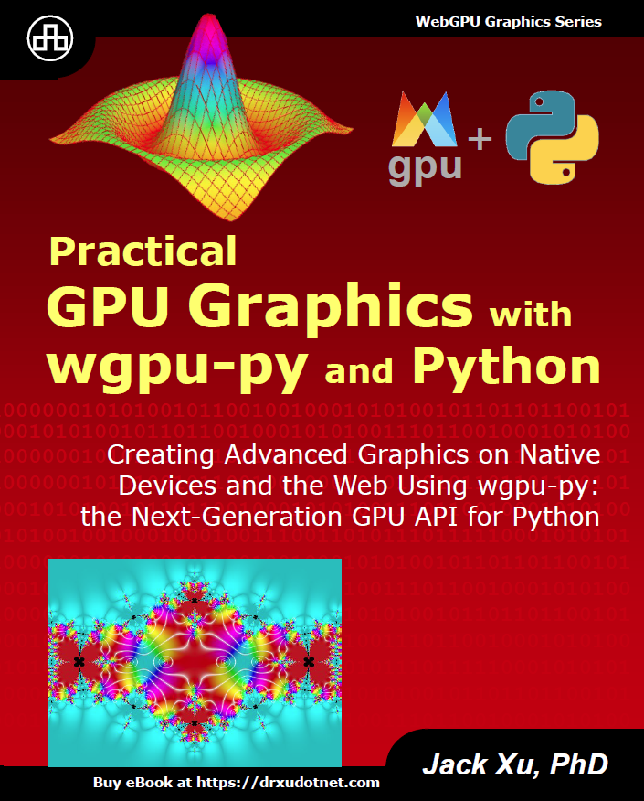
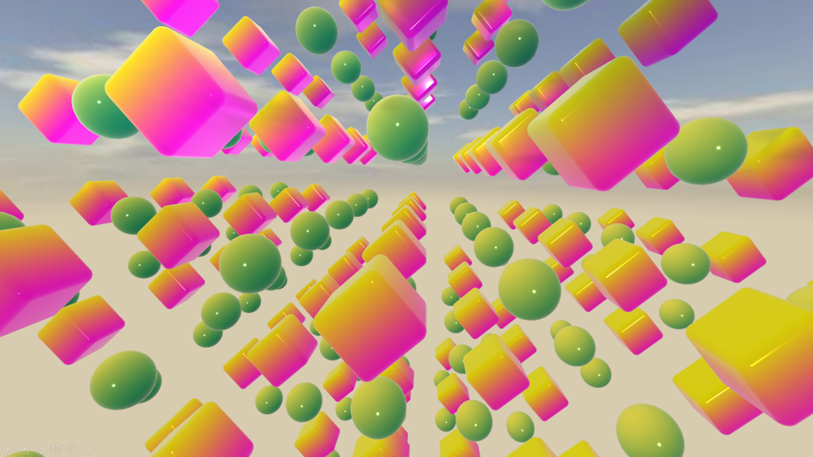
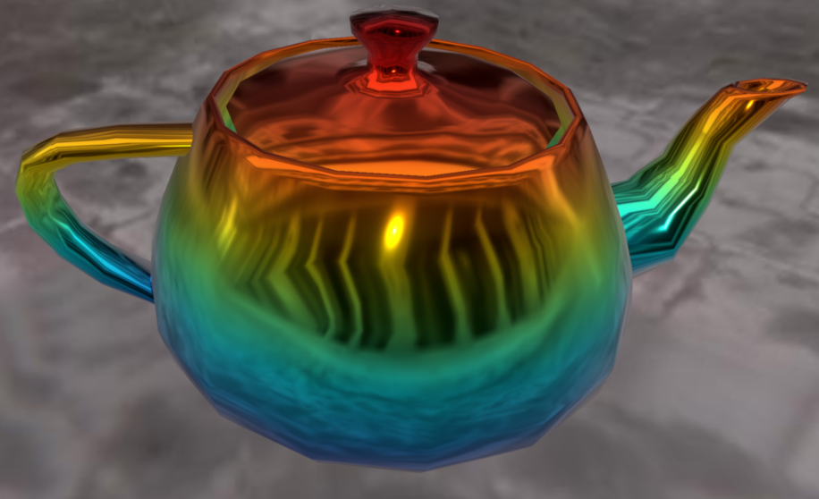
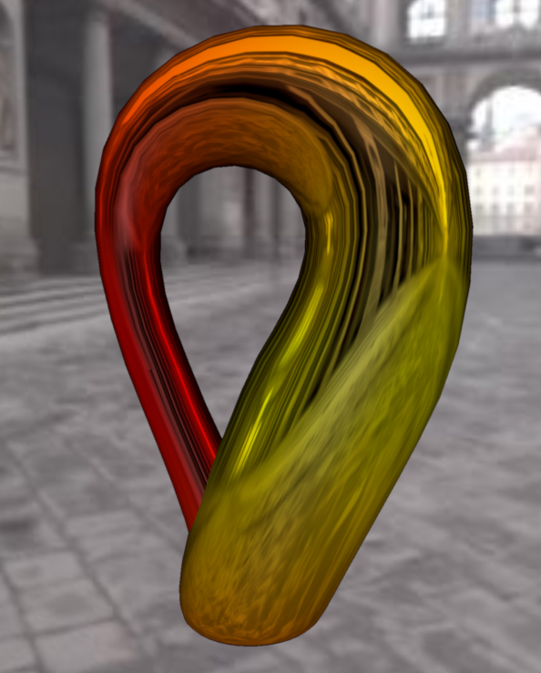
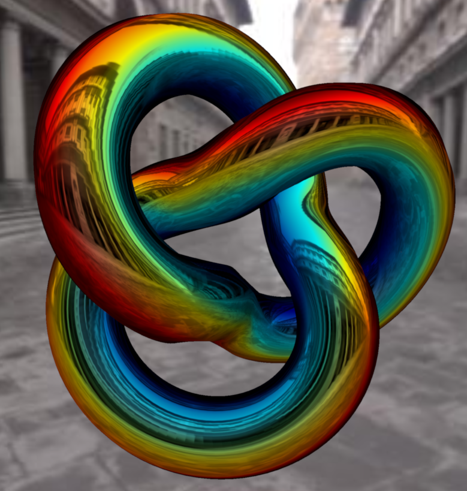
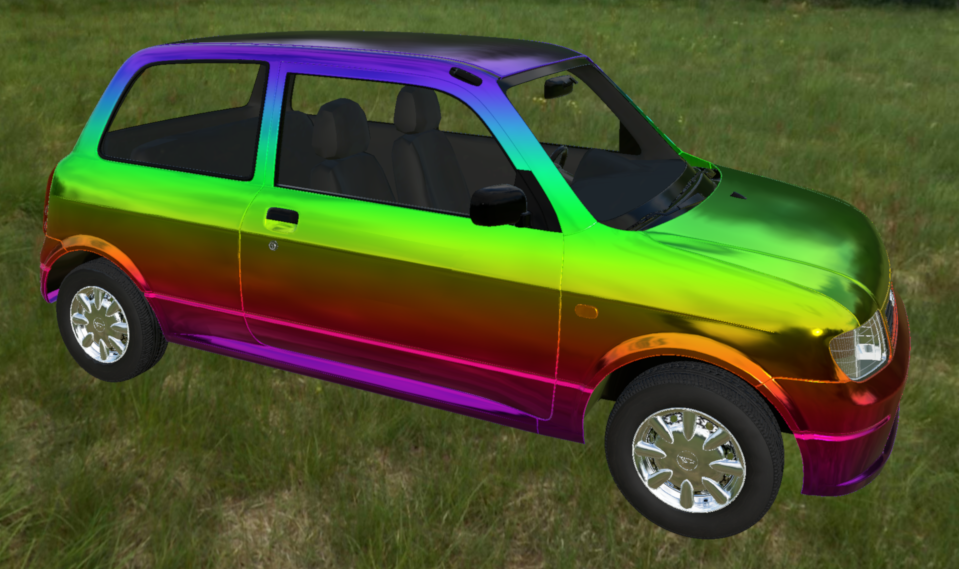

# WebGPU in Python 

*wgpu-py* is a Python implementation of WebGPU - the next generation GPU API, while *pygfx* is a Python rendering engine for WebGPU based on *wgpu-py*. This rendering engine enables the creation of a wide variety of graphics applications in Python. Its high-level abstractions make it easy to begin coding with WebGPU, while also allowing developers to craft custom and optimized rendering solutions. With just a few lines of code, intricate 3D objects can be created, as demonstrated on your screen.

In this YouTube video series, I'll use real-world sample apps to explain the basics of *pygfx* rendering engine, including its structure, geometries, materials, lighting, and cameras. Throughout this series, I’ll guide you in creating a variety of advanced 3D graphics on the *pygfx* engine, including stunning 3D objects with lighting effects, colormaps, and texture mapping.

 

## Books on WebGPU in Python
Most of the examples used in this video series are taken from my recently published books **"Practical GPU Graphics with wgpu-py and Python"** 

Please see details about these books at https://drxudotnet.com. 

 

## YouTube Video Links:

Please visit my YouTube channel: [Practical Programming with Dr. Xu](https://www.youtube.com/c/PracticalProgrammingWithDrXu)

### Video Series for Rust wgpu Step-by-Step:

1. Introduction: https://youtu.be/i6WMfY-XTZE

 

## Sample Objects 
Here are some sample objects created using the *pygfx* engine, which I will discussed in this video series.

### Cubes and Spheres:
 

### Teapot:
 

### Klein Bottle:

### Torus-Knot:

### A Realistic Car:
 

 

## Run Examples

All examples are stored in the *src* folder. From the root (or CODE_EXAMPLES) folder, you can use the following command to run the specified example:

`python src/video_01/showcase.py`

## License

The MIT License (MIT).

Copyright (c) 2024 Jack Xu.

Permission is hereby granted, free of charge, to any person obtaining a copy of this software and associated documentation files (the "Software"), to deal in the Software without restriction, including without limitation the rights to use, copy, modify, merge, publish, distribute, sublicense, and/or sell copies of the Software, and to permit persons to whom the Software is furnished to do so, subject to the following conditions:

The above copyright notice and this permission notice shall be included in all copies or substantial portions of the Software.

THE SOFTWARE IS PROVIDED "AS IS", WITHOUT WARRANTY OF ANY KIND, EXPRESS OR IMPLIED, INCLUDING BUT NOT LIMITED TO THE WARRANTIES OF MERCHANTABILITY, FITNESS FOR A PARTICULAR PURPOSE AND NONINFRINGEMENT. IN NO EVENT SHALL THE AUTHORS OR COPYRIGHT HOLDERS BE LIABLE FOR ANY CLAIM, DAMAGES OR OTHER LIABILITY, WHETHER IN AN ACTION OF CONTRACT, TORT OR OTHERWISE, ARISING FROM, OUT OF OR IN CONNECTION WITH THE SOFTWARE OR THE USE OR OTHER DEALINGS IN THE SOFTWARE.
 
